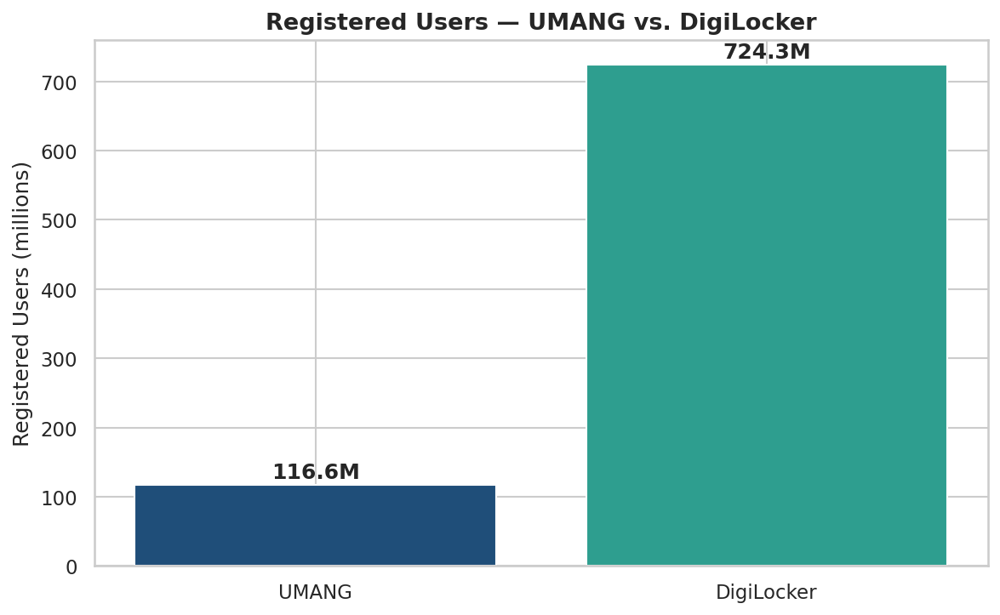
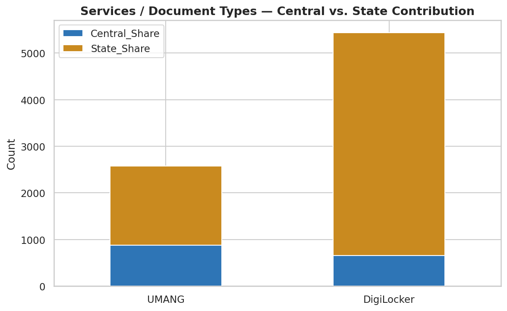
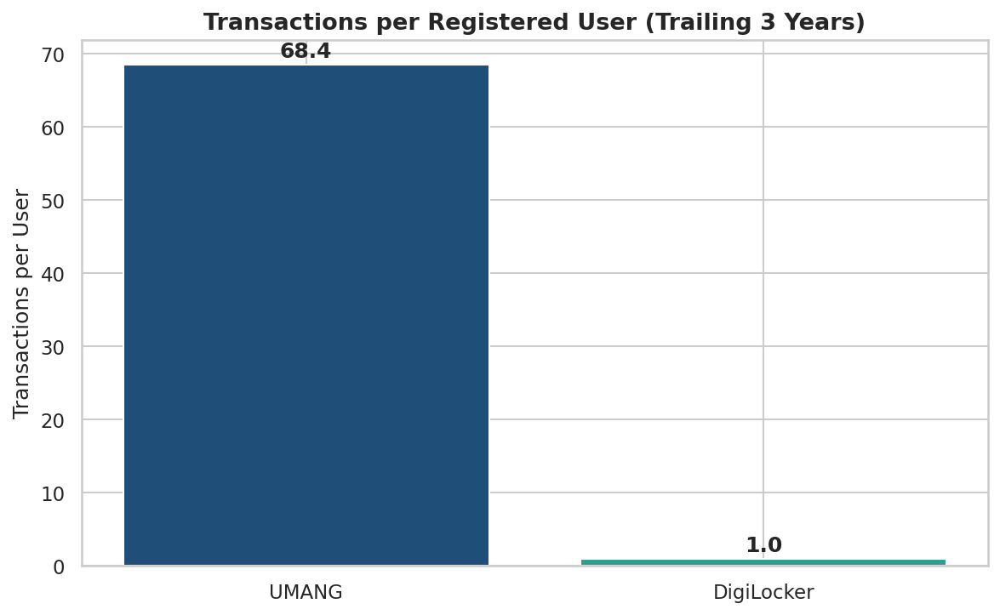

`# DigiPulse-India-s-E-Governance-Usage-Analytics`

<div align="center">

# In DigiPulse
### India's E-Governance Usage Analytics

*Tracking the pulse of India's Digital Public Infrastructure — one government dataset at a time.*


**[📓 Notebook](notebooks/02_umang_digilocker_data_cleaning.ipynb) · [📊 Live Dashboard](dashboard/umang_digilocker_dashboard.html) · [📄 Full Report](docs/Week2_Data_Collection_Cleaning.docx)**

</div>

---

## ✨ What is DigiPulse?

**DigiPulse** collects, cleans, and analyzes official usage statistics for India's two flagship
citizen-facing e-governance platforms — **UMANG** and **DigiLocker** — turning a single government
parliamentary statement into a clean, structured, analysis-ready dataset and an interactive
dashboard.

No scraping, no synthetic data — every number here traces back to a **written reply by the Union
Minister for Electronics & IT to the Rajya Sabha on 7 August 2026**, cross-verified across five
independent news syndications before being trusted.

> 🔍 **Why it matters:** UMANG and DigiLocker sit at the citizen-facing layer of India's *India
> Stack* — the same digital public infrastructure that underpins Aadhaar-based identity, UPI
> payments, and paperless government service delivery. Understanding how these platforms are
> actually used is a direct window into how well India's digital governance push is working.

## 📌 Headline Numbers

| Metric | UMANG | DigiLocker |
|---|---:|---:|
| Services / document types | **2,575** | **5,437** |
| Registered users | **11.66 crore** (116.6M) | **72.43 crore** (724.3M) |
| Transactions (trailing 3 yrs) | **~798 crore** (7.98B) | **~72.86 crore** (728.6M) |
| Transactions per user (3 yrs) | **~68.4** | **~1.0** |
| State Govt. share of services | 65.8% | 87.8% |

*As reported to Parliament, 7 August 2026 · Platform metrics as of 31 July 2026*

## 📈 Visual Insights

<table>
<tr>
<td width="33%"></td>
<td width="33%"></td>
<td width="33%"></td>
</tr>
<tr>
<td align="center"><sub>DigiLocker's reach dwarfs UMANG's</sub></td>
<td align="center"><sub>State Govts drive most service delivery</sub></td>
<td align="center"><sub>UMANG: repeat-use app · DigiLocker: one-time wallet</sub></td>
</tr>
</table>

> **The standout insight:** DigiLocker has 6x more registered users than UMANG, but users transact
> on it only **once every 3 years on average** — it behaves like a document wallet. UMANG, despite
> a smaller user base, sees **68 transactions per user** in the same window — a genuine repeat-use
> utility app for bill payments, certificates, and everyday government services.

## 🗂️ Project Structure

```
digipulse/
├── README.md
├── requirements.txt
├── notebooks/
│   └── 02_umang_digilocker_data_cleaning.ipynb   ← full pipeline, executed with outputs
├── data/
│   ├── umang_digilocker_stats.csv                ← raw structured extraction (source of truth)
│   ├── umang_digilocker_cleaned.csv               ← validated + derived-metric output
│   └── umang_digilocker_pivot.csv                 ← platform × metric pivot table
├── assets/charts/                                 ← static chart exports
├── dashboard/
│   └── umang_digilocker_dashboard.html            ← self-contained interactive dashboard
└── docs/
    └── Week2_Data_Collection_Cleaning.docx        ← full written report
```

## 🧪 The Pipeline

```
Government Statement (Rajya Sabha) → Manual Structured Extraction → Validation →
Derived Metrics → Visualization → Interactive Dashboard
```

1. **Extraction** — figures manually transcribed from the official parliamentary reply (no
   downloadable file existed), preserving original units (*crore*), Central/State splits, and
   precision qualifiers ("exact" vs. "approximate").
2. **Validation** — Central Share + State Share reconciled exactly against every reported total
   (e.g. 880 + 1,695 = 2,575 for UMANG) — confirming zero transcription error.
3. **Derived metrics** — transactions-per-user, state-share percentages, unit conversions.
4. **Visualization & dashboard** — static charts + a fully offline, self-contained interactive
   HTML dashboard (Plotly embedded inline — works with zero internet connection).

## 🚀 Getting Started

```bash
git clone <your-repo-url> && cd digipulse
python -m venv venv && source venv/bin/activate   # Windows: venv\Scripts\activate
pip install -r requirements.txt
jupyter notebook notebooks/02_umang_digilocker_data_cleaning.ipynb
```

To view the dashboard, just open [`dashboard/umang_digilocker_dashboard.html`](dashboard/umang_digilocker_dashboard.html) in any browser — no setup required.

## 🧰 Tech Stack

| Purpose | Library |
|---|---|
| Data handling | `pandas`, `numpy` |
| Static visualization | `matplotlib`, `seaborn` |
| Interactive dashboard | `plotly` |
| Notebook environment | `jupyter`, `nbformat` |

## ⚠️ Limitations

- A single point-in-time snapshot (6 rows by nature) — not a time series, so trend analysis isn't
  possible from this dataset alone.
- Figures are government-self-reported; cross-verified for consistency across sources, but the
  platforms' internal counting methodology was not independently audited.

## 📄 Data Attribution

Statistics originally reported by the **Ministry of Electronics and Information Technology
(MeitY), Government of India**, via a written reply to the Rajya Sabha (7 August 2026). This
project is an independent educational analysis and is not affiliated with or endorsed by MeitY,
UMANG, or DigiLocker.

---

<div align="center">

**Built with 🧡 for open, reproducible e-governance analysis**

*Data Analyst Internship — Week 2: Data Collection & Cleaning*

</div>
